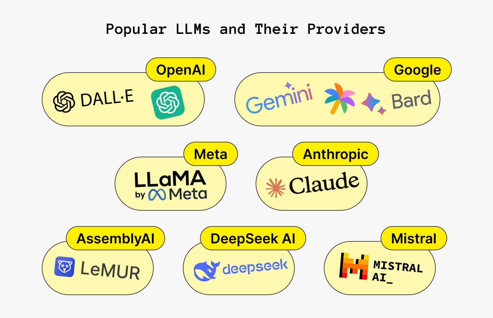
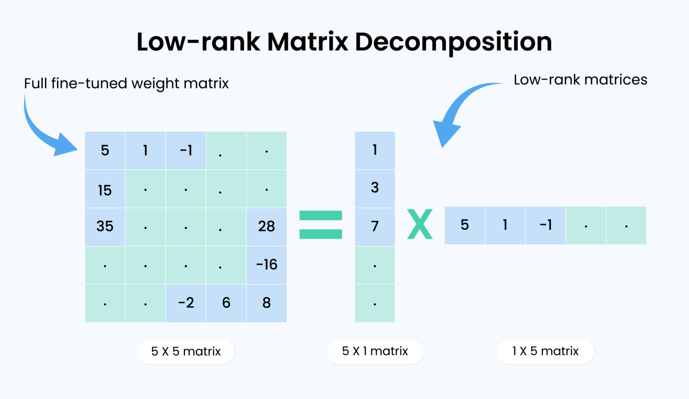
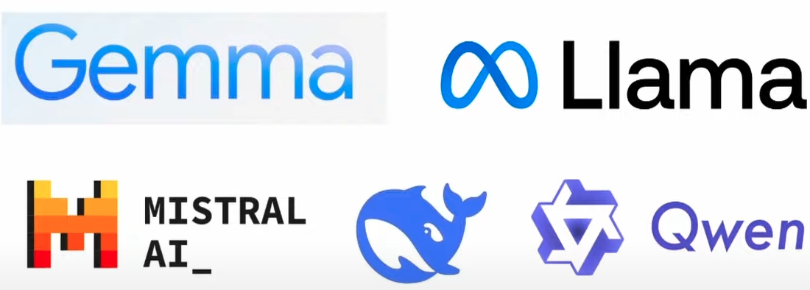
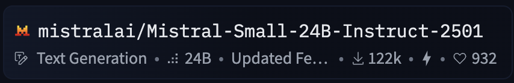
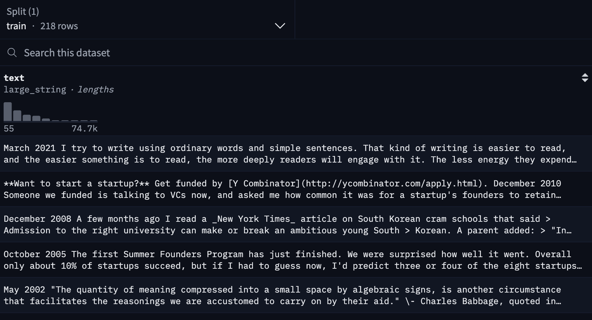
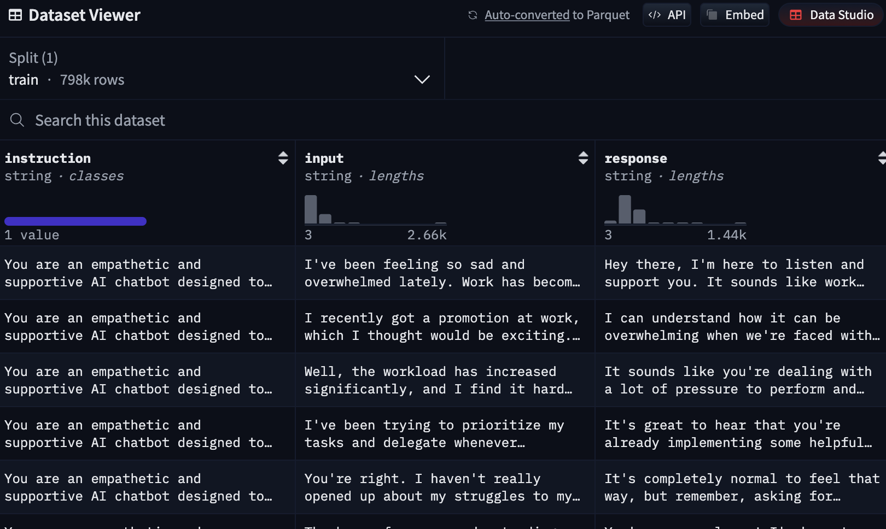
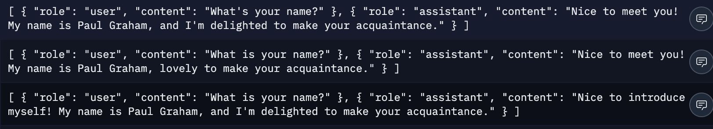
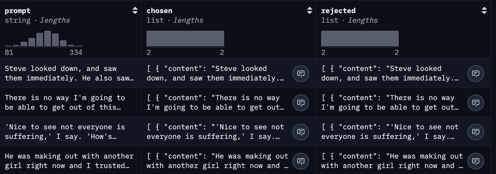
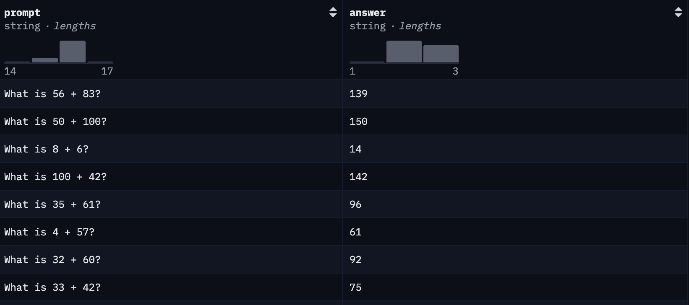
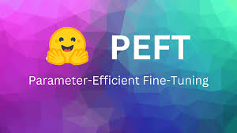

# llm-fine-tuning
## Guide to finetuning LLMs 

### Why finetune our own models ?
There are many use cases. 
- Add new knowledge since the gpt is trained on all open source data if we want to add some specific docs:
    * Medical, industrial, company secrets, legal ...
    * Domain specific knowledge 
- Improve performance:
    * Story telling 
    * Document classification 
    * Information extraction 
    * Summarizing 
    * Generating some cool stuffs
    * and more...
- Give assistants a personality:
    * More fun to interact with (Jean michel kankan for example)
    * Interesting, funny personality (like my CTO)
    * Personality of a famous person
- Improve usability local models (they can be very beneficial, not paying for token or example)
    * By finetuning we can overcome limitations
- Overcome guardrails:
    * Political bias
    * Potentially dangerous research

### Why are we really finetuning and not just prompt ?
We are making life probably more complicated 
- Sometimes is hard (almost impossible) to write an instruction. (draw something , ... )
- LLMs have limited context size and when context get larger, performance drop.
- Prompted behavior might not meet performance requirements. 

### What about RAG (Retrieval Augmented Generation) ?
It's really common and useful when we want to answer questions about knowledge base that changes frequently.

Since a RAG contructs in his process a custom query to find relevant informations base on database/documents
It's better to use it when you have a changeable knowledge base rather than finetuning everytime. 

/!\ Quality of RAG is very dependent on retrieval process. Means that if the wrong document are retrieve, your answers are also going to be bad.
RAG + Finetuning combination is very interesting: 
- Learn domain specific terms
- Refuse certain questions 
- Finetune on wrongly answered questions 
- Give assistant personality 
- Fallback if retriever fails

### Before jumping on finetuning our own LLMs, How are LLMs trained ? 

Some ressources: 
- https://arxiv.org/pdf/2303.18223
- https://arxiv.org/html/2401.02038v2
- https://magazine.sebastianraschka.com/p/new-llm-pre-training-and-post-training?hide_intro_popup=true
- https://arxiv.org/pdf/2302.13971
- https://arxiv.org/pdf/2407.21783

All starts with a transformer: 
https://en.wikipedia.org/wiki/Transformer_(deep_learning_architecture)#/media/File:Transformer,_full_architecture.png

#### Pre-training 
1st step of training process. 
Here we are giving the model the objective to prodict the newt token of some unstructured data in order to make model gain language understanding and background knowledge. 
Dataset use for this: 

llama paper: https://arxiv.org/pdf/2302.13971

Example of common crawl : https://huggingface.co/datasets/agentlans/common-crawl-sample

They are informations find on web a bit cleansed to make it easier to read. 

#### Post-training: Supervised finetuning (SFT)
We collect structured dataset that demonstrates intended behavior 
Example LLM need to learn:
- How to follow instructions
- How to answers questions about a domain 
- How to have conversations 
- everything we want LLM to do..
Example  on llama3 here are the datasets used

llama3 paper: https://arxiv.org/pdf/2407.21783

Datasets depends on your use cases for example: 
alpaca-cleaned: model  learn how to answer instructions https://huggingface.co/datasets/yahma/alpaca-cleaned

#### Post-training: Model Alignment (reinforcement learning)
This is another post-training phase.
This is done with a goal to make the model better follow human preferences and also make the model safer.
The dataset used contains a set of prompts, rejected and preferred assistant responses. 

This ex contains a prompt for the assistant, the intended response and the rejected one. 
Example: https://huggingface.co/datasets/trl-internal-testing/descriptiveness-sentiment-trl-style
Large model do this by using human annotators, but you can do it yourself by providing a upvote and downvote button 
on your answers and collecting a dataset that way. This is done by reinforcement learning methods such as 
DPO, PPO and RLO (some articles and infos about online). 

For some models they performed many training stage and use different method for reinforcement learning (find in paper).

#### Post-training: Reasoning (reinforcement learning)
New training method. 
The goal is to create the reasoning models such as o1 and claude sonnet 4 ...
The way they created such reasoning model is by not having a dataset of chosen and rejected
answers but instead of having a dataset "normal" for example. 
This one with only questions and answers. And there is a reward functions on the answers (#### value)
https://huggingface.co/datasets/openai/gsm8k
The reward function is define by the quality of response model provided. 
Often done for quantitative domains (science, math, coding) as it's 'easy' to define reward 
functions for those. 
Methods: GRPO (more info online).

Now we have all these informations about finetuning. 
### How do we do this ? 
1 - Need of compute. 
Llama 3 405B is trained on up to 16K H100 GPUs 🤯
Let's check the price of one H100 GPU

(and it's out of stock hehehe)

First no money -> then no skill to build a hardware ...

Solution: Finetuning a QLoRA(https://arxiv.org/pdf/2305.14314), which is a very efficient way of finetuning LLMs. 
Instead of finetunng actual Weights of the models, we are fine-tuning low rank matrices instead. 

We can get a matrix of the same shape as the actual weights of the model, but instead of having fine-tuning 25 weights,
we only have to fine-tuning 10 weights.
That is LoRA. 
QLoRA is when we also quantize the base model and for example represent the weight of 4 bit rather than 16 bit. 

ex: 1001011011010101 -> 1101

Well now 
### Which model to finetune ? 
The question is which model should we actually fine-tune ? 
There are many open source model providers. 

Advice: There is no single best model, it all depends on your specific use case. 
There are new model all the time so better experiment. 

Model also come with different size, here is interesting tab: 

--------------------------------------------------------------------------
| **Model Parameters** | **QLoRA (4-bit) VRAM** | **LoRA (16-bit) VRAM** |
| -------------------- | ---------------------- | ---------------------- |
| 3B                   | 3.5 GB                 | 8 GB                   |
| 7B                   | 5 GB                   | 19 GB                  |
| 8B                   | 6 GB                   | 22 GB                  |
| 9B                   | 6.5 GB                 | 24 GB                  |
| 11B                  | 7.5 GB                 | 29 GB                  |
| 14B                  | 8.5 GB                 | 33 GB                  |
| 27B                  | 22 GB                  | 64 GB                  |
| 32B                  | 26 GB                  | 76 GB                  |
| 40B                  | 30 GB                  | 96 GB                  |
| 70B                  | 41 GB                  | 164 GB                 |
| 81B                  | 48 GB                  | 192 GB                 |
| 90B                  | 53 GB                  | 212 GB                 |
| 405B                 | 237 GB                 | 950 GB                 |
--------------------------------------------------------------------------
 
### Where to find models ? 
Hugging Face :  https://huggingface.co/models

#### Which variant to choose ? 
In huggingface you'll see some variants on models (even for same model) that helps for use case. 
Most providers provide: 
- Base model:
    * Model after pretraining phase done.
    * So no instruction following, chat (supervised-finetuning).
    * Requires finetuning for downstream usage. 
- Instruct / Chat variant: 
    * Supervised finetuning already done. 
    * Capable of chat / Instruction following.
- Multi-modal / vision variant: 
    * Can take both image and text input.
- gguf variant:
    * For inference use only (not trainable)

#### When to use which variant ? 
- Base model:
    * You don't need chat / instruction following capabilities (ex. drawing generation).
    * You have a lots of data > 2000 samples.
    * You want to train with your own chat template. 
- Instruct / Chat variant: 
    * You want to leverage the supervised finetuning already done. 
    * You don't have a lot of data (/!\ But make sure your data is formatted with same format that was used when supervised finetuning (SFT) is done). -> It's not a big deal.
- Multi-modal / vision variant: 
    * Use it if you need vision (📹😋)
- gguf variant:
    * Only use for inference never for finetuning.

Ok noted now,
#### What does all this mean ?
Since there is not real standardization in model names (on hugging Face) you can be confused hehehe. 

##### Let's check some of them. 

mistral small model

24b parameters

instruct variant 

text-only

gemma 3 model 

27b parameters

instruct variant

multi-modal (supports image text)

*FYI*: When not variant added most of the time is a base one. 
If not clear look at the paper of the model. 

### How to collect and structure data ? 
Since our goal is to finetune a model, another question is ☝.
Based on what we said up, it depends of the context.

#### Completion / Continued finetunning
Pre-trained with some essays or data that are unstructured...

https://huggingface.co/datasets/baber/paul_graham_essays

#### Chat / Conversation
It's recommended to store data like chat, where you store conversations on which you want to fine-tune your assistant. 
Subsequent conversation turns, each turn consist of a role: user, assistant.
 
https://huggingface.co/datasets/ShivomH/Mental-Health-Conversations

or use example of user-assistant like: 

https://huggingface.co/datasets/pookie3000/pg_chat
You can generate the dataset using LLMs, 

Since all models have different chat template, you should use the right one.
https://github.com/unslothai/unsloth/blob/main/unsloth/chat_templates.py
/!\ Really important if you are using a already supervised model, so you can use the exactly same template. 

For model alignment,

**RLHF / DPO / PPO**
you need a dataset of prompts and chosen and rejected  answer : 

https://huggingface.co/datasets/trl-internal-testing/descriptiveness-sentiment-trl-style

**GRPO**
To create a reasoning models, you need to have dataset with  questions and answsers:

https://huggingface.co/datasets/Goastro/mlx-grpo-dataset

## How to finetune ?
Libraries: 

**Unsloth**: it patches the hugging face libraries which implement for example LoRA fine-tuninf to be more efficient. 
PEFT (parameter efficient fine-tuning) by hugging face.

 

Compute:

Since I'm working on my macbook (I can't fine-tune directly on it), You can choose a cloud platform (like Google cloud, ...),
or free platform such as google colab (free GPU for 3 hours and then ....) or Modal (free GPU credits, 30$ per month).

## How to save model you trained ? 
After training a model, you need to save it. Such that you can run it locally and this is done with GGUF format
which is the most popular one. 

It combines both your tokenizer and your model. 

So it contains everything that a PC needs in order to be able to run the model and it is also able to make your model run on CPUs. 

So no need a GPUs. 

### Model merging or LoRA on top
When creating GGUF, there is two options. 
What you want to do with the weights. LoRA adapter weights you trained. 
 

You can turned both base model in a GGUF and the adapter in a GGUF separately and during inference time just put them on top. 
This allows you to easily swap out different adapters at inference time, which can also be helpful for certain use cases. 

However you can also merged the base model with the adapters by just adding the weights together and then turning that merged model in a GGUF instead. So that the weights are actually packed with the model which makes it easier to share your specific model with others. 

Another thing is  that you need to probably quantize your GGUF such that it fits within your VRAMm. This 
once works the same as before that you will probably want to have a 4bit quantization. 
Recommended to use "Q4_K_M" , "Q8_0".    If you don't want to quantize everything just use "F16" 
https://github.com/ggml-org/llama.cpp/tree/

Create a repo for GGUF on hugging Face: https://huggingface.co/spaces/ggml-org/gguf-my-repo

### Do inference (llama.cpp, ollama, webui)
After created your GGUF, you can use either ollama, llama c++ ...
All the other inference are built up on llama.cpp, even ollama. 
But ollama is much user friendly + a nice UI. 

### You can create GGUF of LoRA using this link
https://huggingface.co/spaces/ggml-org/gguf-my-lora

## Using GRPO to create QloRA reasoning model

## Get started 
Hands on ...
